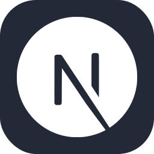

## Hey 👋, My name is [RJ Jefferson](# "Ritch Johan Jefferson")
### Self-Taught Developer from **Indonesia**

It's supposed to be 26.1°C (79°F) and 🌫 light fog today. 
 Have a great Wednesday!

- 💻 I'm currently working on **[personal utilities](https://hi.jeffersonrj.com)**
- 🌱 I'm currently learning **CS50**
- 🚀 All of my projects are available at **[jeffersonrj.com/projects](https://jeffersonrj.com/projects)**
- ⭐ I've started to commit to solving 1 to 3 questions each week on  **[LeetCode](https://leetcode.com/u/jeffersonrj14/)**
- ⚡ Fun fact **I'm a night owl person**
- 📫 You can contact me through DM on **[Discord](https://discordapp.com/users/606481557615542273)** or via **[Email](mailto:jefferson@jeffersonrj.com)**
 

  
Coding Activity

  

### Languages and Tools:

 

&nbsp;

